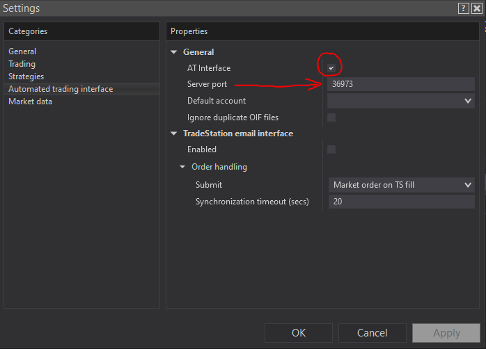

<p align="center">
  
</p>

<p align="center">
  <strong>Real-time WebSocket signal gateway for NinjaTrader 8</strong>
</p>

<p align="center">
  <a href="https://github.com/42U/socket-trader/actions/workflows/ci.yml"></a>
  <a href="https://www.python.org/downloads/"></a>
  <a href="LICENSE"></a>
  <a href="#"></a>
  <a href="#ninjatrader-setup"></a>
  <a href="https://voidorigin.com"></a>
</p>

<p align="center">
  <a href="#installation">Installation</a> &nbsp;·&nbsp;
  <a href="#ninjatrader-setup">NinjaTrader Setup</a> &nbsp;·&nbsp;
  <a href="#usage">Usage</a> &nbsp;·&nbsp;
  <a href="#keyboard-controls">Controls</a> &nbsp;·&nbsp;
  <a href="#risk-management">Risk</a> &nbsp;·&nbsp;
  <a href="#signal-latency">Latency</a> &nbsp;·&nbsp;
  <a href="#configuration">Config</a>
</p>

---

## Overview

SocketTrader connects to a remote signal server over WebSocket, receives trading signals in real time, and writes them directly into NinjaTrader 8's `incoming/` folder for automated order execution.

```
┌────────────┐    WebSocket    ┌────────────────┐    File I/O    ┌────────────────┐
│   Signal   │ ─────────────▸  │  SocketTrader  │ ─────────────▸ │  NinjaTrader   │
│   Server   │  JSON signals   │      .py       │ raw order text │  8 incoming/   │
└────────────┘                 └────────────────┘                └────────────────┘
```

**Signal format:**
```
PLACE;<account>;<instrument>;<action>;<qty>;<order type>;<limit price>;<stop price>;<tif>;<oco id>;<order id>;<strategy>;<strategy id>
```

**Signal transformation:**
```
IN   {"signal": "PLACE;SimAccount;NQ 06-26;BUY;1;MARKET;;;DAY;;;NQ_Med;1020", "ts": 1711000000000}
OUT  PLACE;YourAccount;NQ 06-26;BUY;1;MARKET;;;DAY;;;NQ_Med;1020
```

The sim account is automatically swapped with your real NinjaTrader account name. Empty fields (`;;`) are optional parameters left at their defaults. Server timestamps are used to display signal latency.

---

## Features

> **Signal in. Order out. No GUI required.**
> SocketTrader runs entirely in the terminal with a keyboard-driven interface, real-time risk controls, and sub-second signal delivery.

| | |
|---|---|
| **Cross-platform** | Windows and Linux support |
| **Copy trading** | Fan one signal out to a leader account **plus multiple follower accounts** — one order file per account |
| **Round-robin** | Link accounts into a rotation pool: each **entry** goes to exactly **one** pool account, drawn randomly with no repeats until every pool account has traded a round — alongside copy trading |
| **Per-account profiles** | Each account can filter which **symbols it trades**, trade micros or full-size, its own contract count, inverted direction, delayed or staggered entries, its own ATM template, and an optional **AI gate** — scoped per symbol / publisher strategy |
| **Manual trading** | Press `O` (or use the web UI) to submit your own long/short market/limit order with an ATM template — it fans out through copy trading, round-robin, and profiles exactly like a publisher signal |
| **Web UI** | A localhost control panel starts with the app: live dashboard, manual orders, pause/flatten/reconnect, micro toggle, accounts, strategy, limits, and profiles from the browser |
| **Micro mode** | One toggle converts every signal to its CME micro contract — NQ→MNQ, ES→MES, RTY→M2K, GC→MGC, … |
| **ATI integration** | Auto-detect accounts, live balances, and position closing via NinjaTrader ATI |
| **Auto-detect directory** | Finds NinjaTrader 8 `incoming/` folder on Windows automatically |
| **Multi-server support** | Save and switch between multiple signal servers |
| **Persistent config** | Server, token, account, limits, and directory saved to `~/.voidorigin_config.json` |
| **Smart reconnect** | Fibonacci backoff: 1 &rarr; 1 &rarr; 2 &rarr; 3 &rarr; 5 &rarr; 8 &rarr; ... &rarr; 30 min max |
| **Auth handling** | Invalid token triggers re-prompt instead of infinite retry |
| **Latency monitoring** | Color-coded signal delivery time relative to baseline |
| **Risk management** | Per-account target and stop with independent soft/hard modes |
| **Live balances** | Press `B` for real-time account balances and session P&L |
| **Signal confirmation** | Verifies trade execution via ATI position tracking per instrument |
| **Trade readiness gate** | Blocks signals when account, directory, or strategy is missing |
| **Duplicate detection** | Prevents the same signal from firing twice |
| **Replay protection** | Signals the server re-delivers after a reconnect are blocked — including id-less commands like `CLOSEPOSITION` that plain id-dedup can't catch |
| **Input validation** | Field length, count, and format checks on all incoming signals |
| **Atomic config writes** | Crash-safe config persistence via temp file + rename |
| **Log rotation** | 5 MB per log file, 3 backups kept automatically |
| **Terminal UI** | Animated boot, color-coded session states, pinned header and controls bar |

---

## Installation

```bash
git clone https://github.com/42U/socket-trader.git
cd socket-trader
pip install -r requirements.txt
```

**Requirements:** Python 3.10+ &nbsp;·&nbsp; NinjaTrader 8 (Windows) or any target directory (Linux)

### Running the tests

```bash
pip install -r requirements-dev.txt
pytest test_sockettrader.py -q      # full suite
python scripts/check_webui.py       # embedded web UI guards (needs node for the JS check)
```

Both run in CI on every push and pull request, across Python 3.10–3.13 on Linux and Windows. The web UI guards catch what the Python suite structurally cannot: a JavaScript syntax error inside the embedded page, a field the dashboard reads that the backend stopped sending, a re-introduced `innerHTML` sink, or a removed request-gating control.

---

## NinjaTrader Setup

Before SocketTrader can send orders, you must enable the **Automated Trading Interface** in NinjaTrader 8:

1. Open **NinjaTrader 8**
2. Go to **Tools** → **Settings**
3. Select **Automated trading interface** from the left panel
4. Check the **AT Interface** checkbox to enable it
5. Note the **Server port** (default: `36973`) — if you change it, go to Setup (`S`) > ATI Port in SocketTrader
6. Click **OK**

<p align="center">
  
</p>

> **Important:** After clicking OK/Apply, you must **restart NinjaTrader 8** for the AT Interface changes to take effect. NinjaTrader must be running with the AT Interface enabled for signals to be processed from the `incoming/` folder.

### Strategy Templates

SocketTrader requires ATM and Stop strategy templates to be installed in NinjaTrader. On first run, the client **automatically copies** these into the correct directories:

| File | Source | Destination |
|------|--------|-------------|
| `NQ_Med.xml` | `strategy/` | `NinjaTrader 8/templates/AtmStrategy/` |
| `algoNQmed.xml` | `strategy/` | `NinjaTrader 8/templates/StopStrategy/` |

This happens automatically — no manual copying needed. If the files already exist, they are not overwritten.

### ATM Strategy Selection

The signal sent to NinjaTrader includes an **ATM Strategy template name** that controls how stops, targets, and trailing behavior are managed for each order. By default, SocketTrader uses `NQ_Med`.

If you want to use a different ATM strategy:

1. Create your custom ATM strategy template in NinjaTrader 8 (via the ATM Strategy selector on a chart or SuperDOM)
2. Press `S` in SocketTrader to open Setup, then select **Strategy** to set the name
3. The new name is saved to config and applied to all future signals

> The ATM strategy name in the signal **must match** an existing template in your NinjaTrader `templates/AtmStrategy/` folder, or the order will be rejected.

---

## Usage

```bash
python SocketTrader.py
```

On first run you'll be prompted in order:

| Prompt | Description |
|--------|-------------|
| **Server** | WebSocket server URL (`ws://` or `wss://`) and an optional name |
| **Token** | Server authentication token |
| **Account** | Auto-detected from NinjaTrader ATI, or manually entered |
| **Directory** | Auto-detected on Windows, manually entered on Linux |

Server and token are required to connect. Account and directory can also be configured later via the Setup menu (`S`).

All settings are saved and loaded automatically on subsequent runs. To change any setting mid-session, press `S` to open the Setup menu.

---

## Keyboard Controls

The controls bar is **pinned to the bottom** of the terminal at all times:

```
  O=ORDER  P=PAUSE  B=BAL  T=LIMITS  C=CLOSE  R=RECONN  S=SETUP  ⇧X=EXIT
```

| Key | Action |
|:---:|--------|
| `O` | Submit a manual order — side, instrument, contracts, market/limit, ATM (see [Manual Trading](#manual-trading--web-ui)) |
| `P` | Pause / resume signal output |
| `B` | Show live balances and session P&L (press `R` to reset P&L) |
| `T` | Set session target and stop limits |
| `C` | Close open positions (arrow keys to select, `Y` to confirm) |
| `R` | Force immediate reconnect (resets backoff) |
| `S` | Open Setup menu (see below) |
| `Shift+X` | Exit SocketTrader |

### Setup Menu

Press `S` to open the Setup menu for all configuration options:

```
┌─ SETUP ──────────────────────────────────────────┐
│  1. Server    (wss://host:8420/ws)               │
│  2. Token     (****)                             │
│  3. Accounts  (Sim101 +2 copy)                   │
│  4. Strategy  (NQ_Med)                           │
│  5. Directory (/path/to/incoming)                │
│  6. ATI Port  (36973)                            │
│  7. Micros    (OFF)                              │
│  8. Profiles  (none)                             │
│  ESC to close                                    │
└──────────────────────────────────────────────────┘
```

Changing the **server** or **token** automatically triggers a reconnect. The server selector supports saving multiple servers:

---

## Copy Trading

SocketTrader can send **the same signal to multiple NinjaTrader accounts at once**. You pick a **leader** account and any number of **followers**; every incoming signal fires on the leader *and* mimics onto each follower.

Press `S` &rarr; `3` to open the account selector:

```
┌─ ACCOUNTS — LEADER · FOLLOWERS · ROUND-ROBIN ─────┐
│  1. Sim101  ($28,857.02) ◀ LEADER                │
│  2. Sim102  ($10,000.00) ＋ FOLLOWER              │
│  3. Sim103  ($10,000.00) ⟳ ROBIN                 │
│  Leader + followers copy every signal.           │
│  Round-robin: each entry rotates to ONE pool     │
│  account.                                        │
└───────────────────────────────────────────────────┘
  LEADER [Sim101] ▸ 1
  FOLLOWERS — copy trade (numbers/names, 'all', ENTER=none) ▸ 2
  ROUND-ROBIN pool (numbers/names, 'all', ENTER=none) ▸ 3 4
```

- **Leader** — the primary account; drives the status-bar P&L display and fill confirmation. Always copy-traded.
- **Followers** — enter the account numbers (or names), the word `all` for every other account, or press `ENTER` for none (single-account mode, the classic behavior).
- **Round-robin pool** — accounts that *rotate* instead of copying — see [Round-Robin Mode](#round-robin-mode). An account can be a follower **or** in the pool, never both (conflicts stay followers).
- Each account receives its **own** order-instruction file with only the account field swapped — instrument, action, quantity, strategy, and signal ID are identical across all accounts.
- Fan-out writes one unique OIF file per account, with filenames guaranteed unique even when several land in the same millisecond.
- **Risk is enforced per account, independently.** Each account has its own [session target/stop](#risk-management); when one account trips its limit, only that account is flattened and locked out for the session — the leader and other followers keep trading. When *every* account has stopped, the session pauses.
- The status bar shows the leader with a copy-count badge, e.g. `Sim101+2: $28,857.02 (+$247.50)`.

Followers are saved to `~/.voidorigin_config.json` (`follower_accounts`) and restored on the next run. Works identically on Windows, WSL2, macOS, and Linux.

---

## Round-Robin Mode

Copy trading gives every account every trade. **Round-robin** spreads trades across accounts instead: link accounts into a pool, and each **entry signal** fires on exactly **one** pool member — drawn randomly, with no account hit twice until every pool account has traded once. Then a fresh random round starts, never opening with the account that just traded, so two consecutive signals never land on the same account.

Both modes run side by side. With 4 accounts — 2 copy + 2 round-robin:

```
Signal 1  →  Sim101 ◀  Sim102 ＋           RR-A ⟳
Signal 2  →  Sim101 ◀  Sim102 ＋                    RR-B ⟳
Signal 3  →  Sim101 ◀  Sim102 ＋           RR-B ⟳   (new round, random)
Signal 4  →  Sim101 ◀  Sim102 ＋   RR-A ⟳
```

The dashboard notes each draw (`→ 3 accts · RR→RR-A`), and `⟳` marks pool accounts in the balances view.

How the pool handles each command:

| Signal | Round-robin behavior |
|--------|----------------------|
| `PLACE` (entry) | Goes to the **next account in rotation** only — this is what advances the round |
| `CLOSEPOSITION` / `CLOSESTRATEGY` / `CANCEL` / `CHANGE` (exits) | Fan to the **whole pool** — only the account actually holding the position/order matches; the rest are ignored by NinjaTrader. Exits never consume a rotation turn |
| `REVERSEPOSITION` | The rotation pick gets the reversal (its turn); every **other** pool account gets a `CLOSEPOSITION`, so whichever account holds the old position still exits |

Notes:

- **Copy or round-robin, never both** — the picker keeps a conflicted account as a follower and tells you. The leader is always copy-traded (it anchors P&L display and fill confirmation).
- **Per-account [profiles](#per-account-profiles) and [risk limits](#risk-management) still apply.** A pool account's turn goes through its own profile (size, qty, AI gate, …); if its profile skips the entry, that turn is consumed — the trade is not re-routed. An account locked by its session stop/target is passed over and forfeits its turn until the pool reshuffles.
- **Symbol filters re-route instead.** A pool account whose [symbol filter](#per-account-profiles) excludes the signal's market is never drawn for it — the entry goes to the next eligible pool account, and the filtered account **keeps its turn** for a market it does trade. If no pool account trades that market, the rotation simply sits the signal out (copy accounts are unaffected).
- **The rotation survives restarts** within the same futures session (saved with session state); changing the pool membership starts a fresh round.
- The pool is saved as `roundrobin_accounts` in config and restored on the next run.

---

## Micro Contract Mode

Flip one switch and every incoming signal trades the **CME micro contract** instead of the full size — same market, same direction, same contract month, ≈1/10 the size. Press `S` → `7` to toggle. The setting persists in config, and a `◆ MICROS` badge appears in the header status bar while active.

```
IN   PLACE;SimAccount;NQ 06-26;BUY;2;MARKET;;;DAY;;;NQ_Med;1044
OUT  PLACE;YourAccount;MNQ 06-26;BUY;2;MARKET;;;DAY;;;NQ_Med;1044
```

Quantity is **not** rescaled — 2 NQ becomes 2 MNQ (≈1/10 the notional exposure). Translation is a lookup table, not an "M" prefix, because micro symbols aren't uniform (Russell is `M2K`, silver is `SIL`):

| Full | Micro | | Full | Micro |
|------|-------|-|------|-------|
| ES  | MES — Micro E-mini S&P 500      | | CL  | MCL — Micro WTI Crude Oil     |
| NQ  | MNQ — Micro E-mini Nasdaq-100   | | NG  | MNG — Micro Henry Hub Nat Gas |
| YM  | MYM — Micro E-mini Dow          | | BTC | MBT — Micro Bitcoin           |
| RTY | M2K — Micro E-mini Russell 2000 | | ETH | MET — Micro Ether             |
| GC  | MGC — Micro Gold                | | 6E  | M6E — E-micro EUR/USD         |
| SI  | SIL — Micro Silver (1,000 oz)   | | 6A  | M6A — E-micro AUD/USD         |
| HG  | MHG — Micro Copper              | | 6B  | M6B — E-micro GBP/USD         |

Behavior notes:

- **Unmapped symbols are sent unchanged** (e.g. `ZB` has no true micro) with a one-time warning in the dashboard and log — the signal still fires, at full size.
- Signals already micro (`MNQ`, `MES`, …) pass through untouched.
- `CLOSEPOSITION` / `REVERSEPOSITION` signals convert too, so server-driven exits target the micro position you actually hold.
- **Toggle while flat.** A position opened before flipping the switch keeps its original symbol — an exit signal arriving after the flip targets the micro symbol instead of your old full-size position. Manual close (`C`) and hard-stop flatten always act on the real positions NinjaTrader reports, regardless of this setting.
- Extend or override the table with a `micro_map` dict in the config file; map a symbol to itself to opt it out (`"GC": "GC"`).

---

## Per-Account Profiles

Copy trading fans identical signals to every account. **Profiles** let each account — the leader included — trade the *same signal its own way*. Press `S` → `8`, pick an account, and shape it:

```
┌─ DEFAULT RULE — Sim102 ──────────────────────────────────┐
│  1.  Entries       on                                    │
│  2.* Size          micros                                │
│  3.* Contracts     fixed 2 · cap 5                       │
│  4.  Direction     normal                                │
│  5.* Entry delay   500ms + 0..250ms jitter               │
│  6.* Stagger       3 tranches × 2000ms                   │
│  7.  ATM override  inherit                               │
│  8.* AI gate       ollama · llama3.2                     │
│  * = set here · number = edit · -number = reset field    │
│  Exits are never blocked, delayed, or AI-gated.          │
│  ENTER = done                                            │
└──────────────────────────────────────────────────────────┘
```

Each account has a **default rule** plus optional **scoped rules** keyed by symbol and/or the publisher's strategy name — built for multi-strategy, multi-symbol setups. The first matching scoped rule overrides the default; a rule written for `NQ` automatically covers `MNQ` too. A `◆ PROFILES` badge shows in the header while any profile is active.

**Symbol filter (`S` on the profile screen).** Before any rules apply, an account can be restricted to the only markets it trades — e.g. `GC` for a gold-only account, `NQ ES` for an index account. Signals for anything else are simply ignored *for that account* (shown as a skipped leg), while every other account trades normally — and the filtered account still participates fully, copy-trade or round-robin, in the markets it does accept. Micro twins count as the same market (`GC` covers `MGC`, `NQ` covers `MNQ`). Some publisher strategies are symbol-specific and some trade several markets; the filter makes an account deaf to the markets you didn't give it, whichever strategy fires the signal. Exits are never filtered — if you tighten a filter while a position is open, its closes still flow.

| Rule field | What it does |
|------------|--------------|
| **Entries** | `off` blocks **new entries only** for that scope — exits always flow |
| **Size** | `inherit` the global micro toggle, or force `micros` / `full` for this account regardless of what the leader trades |
| **Contracts** | `copy` the publisher's quantity, a `fixed` count, or a `multiplier` (`x0.5`, `x10`), plus a hard per-entry `cap` |
| **Direction** | `invert` fades the signal — BUY↔SELL flipped. Non-market entries are skipped (their price levels are for the other side) and publisher `CHANGE` orders are dropped; the account's own ATM template manages its stops |
| **Entry delay** | Fixed ms + optional random jitter before entries fire |
| **Stagger** | Split each entry into up to 10 tranches at an interval (5 contracts in 3 tranches → 2/2/1). Tranche order ids get unique `~T2`, `~T3`… suffixes, and publisher exits (`CLOSESTRATEGY` / `CANCEL` / `CHANGE`) are fanned out to every tranche |
| **ATM override** | A different ATM template for this account — e.g. a micro-sized stop template for a micro account |
| **AI gate** | Ask an AI to approve, veto, or shrink each entry (below) |

**Exit priority is absolute.** No profile setting can block, delay, or AI-gate an exit. A `REVERSEPOSITION` a rule won't take as a new entry (disabled scope, inverted limit order, sized to zero) is downgraded to `CLOSEPOSITION` so the old position still closes. Pausing, a session stop, or a hard lock aborts pending delayed/staggered entries before they fire.

### AI Signal Gate

Route an account's entries through an AI before they hit NinjaTrader. The model receives the proposed order plus session context (P&L, open positions, time of day, your custom guidance) and must answer:

```json
{"decision": "allow" | "skip", "qty": 2, "reason": "size down into FOMC"}
```

- **Providers:** `anthropic` (official SDK, default model `claude-opus-5` — set `claude-haiku-4-5` for the lowest latency), `openai` (`gpt-4o-mini` default), `ollama` (local, `llama3.2` default), or `custom` — any OpenAI-compatible endpoint (LM Studio, vLLM, llama.cpp server, …).
- **API keys** are read from environment variables (`ANTHROPIC_API_KEY`, `OPENAI_API_KEY`, or your own) — never stored in config.
- The AI can only **veto or shrink** an entry; it can never increase size, and exits never pass through it.
- **Fail-closed by default:** if the AI errors or times out (default 8s), the entry is skipped. Set `on error: allow` per rule to trade through outages instead. Every verdict is logged with its latency and reason.
- Entries gated by AI (or delay/stagger) run in the background — other accounts' legs fire immediately and are never held up.

### Config

Profiles persist in `~/.voidorigin_config.json` under `account_profiles` and are fully hand-editable:

```json
"account_profiles": {
  "Sim102": {
    "default": { "size": "micros", "qty_mode": "fixed", "qty_value": 2, "delay_ms": 500 },
    "rules": [
      { "symbols": ["NQ"], "strategies": ["NQ_Med"], "stagger_entries": 3, "stagger_interval_ms": 2000 },
      { "strategies": ["algoNQmed"], "enabled": false },
      { "symbols": ["ES"], "direction": "invert",
        "ai": { "provider": "ollama", "model": "llama3.2", "timeout_ms": 5000, "on_error": "skip",
                "instructions": "Skip entries in the first 2 minutes after CPI or FOMC releases." } }
    ]
  }
}
```

Accounts without a profile behave exactly as before — identical copy of the leader's signal.

---

## Manual Trading & Web UI

Press **`O`** in the terminal to submit your own order: side (long/short), instrument, contracts, market or limit (with price), and ATM template (ENTER = session strategy). A manual order is dispatched through the **same pipeline as a publisher signal** — it fans out to the leader, followers, and the round-robin rotation, and every per-account profile (symbol filter, micros/full sizing, contract count, ATM override, AI gate) applies. Manual orders always carry an ATM template so stops/targets are attached, and a unique `man…` signal id. Session hard/soft locks block manual trading; **pause does not** — pause mutes the publisher, not you.

A **web UI** starts automatically with the app and prints its address at launch (default `http://127.0.0.1:8720`; it binds to localhost only). It's built for clicking, not typing — everything below is a button, chip, or stepper:

| Panel | What you can do |
|---|---|
| **Order ticket** | BUY/SELL toggle, instrument chips (auto-filled from your open positions and session instruments), `−`/`+` contract stepper with 1/2/3/5/10 quick picks, MARKET/LIMIT toggle, ATM dropdown, one big submit button that reads back the order |
| **Controls** | Pause/resume, reconnect, micro toggle, reset session P&L, flatten all |
| **Open positions** | Every managed account's live positions with a per-position **CLOSE** button — the web equivalent of the terminal's `C` menu |
| **Accounts** | Role, P&L, profile summary, and stop status per account; the rotation line shows who's owed a turn. **Click any row** to edit that account |
| **Account editor** | Risk limits (target/stop with OFF/SOFT/HARD buttons) and the full trade profile — symbol filter chips, entries on/off, size, contracts mode + cap, direction, delay/jitter, stagger, ATM override — all clickable |
| **Accounts / Strategy / Micro map** | Assign leader, followers, and the round-robin pool by clicking roles against NinjaTrader's account list; pick the session ATM template and locked/follow mode; edit micro-contract mappings |
| **Activity** | The same signal and alert feed shown in the terminal dashboard |

Config keys: `webui_enabled` (default `true`, set `false` to disable) and `webui_port` (default `8720`; if busy, an ephemeral port is used and logged). The connection bootstrap (server, token, incoming directory) still happens in the terminal on first run, and **AI gates are terminal-only** — see below.

### Web UI security

The web UI can submit orders and flatten accounts, so the localhost bind is deliberately **not** treated as the security boundary — a browser on this machine can be pointed at it by any page you visit. Every request is checked three ways:

- **Token** — a random per-process secret is embedded in the page and echoed back in an `X-ST-Token` header. Requests without it are refused, so another site cannot drive your trading API, and it forces a CORS preflight that a cross-origin caller cannot satisfy.
- **Origin** — a request carrying a foreign `Origin` is rejected outright.
- **Host** — only loopback hostnames are accepted, which defeats DNS rebinding (a hostile domain re-resolved to `127.0.0.1`).

Requests must be `application/json`; the page is served with a strict CSP and `X-Frame-Options: DENY`. A hard-stopped session freezes settings changes, so risk limits can't be weakened while a lockout is in force. **AI gates cannot be configured over HTTP** — an AI gate names an outbound endpoint and an environment variable whose value is sent as a bearer token, so it's terminal-only; existing gates are preserved untouched when you edit a profile from the browser.

---

## Live Balances

Press `B` at any time to see all NinjaTrader accounts with real-time balances and session P&L:

```
  ╭─ BALANCES ─────────────────────────────────╮
  │  Sim101      $28,857.02  P&L: +$247.50 ◀  │
  │  SimXFAFK     $3,939.48  P&L: -$60.52      │
  ╰────────────────────────────────────────────╯
```

- Balances are queried live from NinjaTrader ATI
- Session P&L is calculated from the balance snapshot taken on connect
- `◀` marks the currently active account

---

## Risk Management

SocketTrader includes built-in risk controls that monitor your account balance in real time via the NinjaTrader ATI. Press `T` to configure.

> **There is no separate on/off toggle.** The dollar amount *is* the switch:
> - **Set a value** (e.g. `500` or `-300`) → that limit is **active**
> - **Set to `0`** → that limit is **disabled**
>
> By default both are `0` — SocketTrader will not interfere with your trading unless you explicitly set a limit. Target and stop are independent — you can use one, both, or neither.

### How It Works

1. On connect, SocketTrader snapshots your account balance from NinjaTrader ATI
2. Every 3 seconds, it polls your current balance and calculates session P&L
3. If P&L crosses your configured threshold, the appropriate action fires

### Session Stop

A **floor** for your session P&L. Triggers when P&L drops to or below this value. Set to `0` to disable.

- **Negative value** (e.g. `-300`): classic loss limit — stop out if you lose $300
- **Positive value** (e.g. `200`): profit protection — if you're up $500 and set stop to `200`, it triggers if P&L drops back to $200, locking in at least $200 of profit. Capped at 90% of current P&L to prevent accidental instant triggers

### Session Target

A **profit goal** for the session (positive dollar amount). Triggers when session P&L reaches or exceeds this value. Set to `0` to disable.

### Soft vs Hard Mode

Each limit (target and stop) can independently be set to **soft** or **hard** mode:

| Mode | Action | Recovery |
|------|--------|----------|
| **Soft** | Pauses signals · press `P` to resume | Resume any time with `P` |
| **Hard** | Flattens all positions · signals off for the session | Press `Shift+X` to exit — cannot resume |

When a **hard** limit fires, SocketTrader writes a `CLOSEPOSITION;{account};{contract};;;;;;;;;;` file to the `incoming/` folder for every instrument traded during the session. This tells NinjaTrader to flatten all positions immediately.

**Defaults:** Target defaults to **soft**, stop defaults to **hard** — but you can set any combination:

| Example | Use case |
|---------|----------|
| Target: soft, Stop: hard | Lock in profits (resumable), auto-flatten on loss |
| Target: hard, Stop: hard | Walk away — both sides close everything |
| Target: soft, Stop: soft | Gentle nudge on both sides, always resumable |
| Target: off, Stop: hard | No profit cap, hard loss protection only |

### Configuring Limits

Press `T` during a session:

```
┌─ SESSION LIMITS (Sim101) ────────────────────────┐
│  Balance: $28,857.02  ·  Session P&L: +$0.00     │
│  Target: +500.00 (soft)  ·  Stop: -300.00 (hard) │
│  When a limit is hit, the lockout mode decides:  │
│  soft = pause signals · resumable with P         │
│  hard = flatten all positions · signals off      │
│  Enter 0 to disable. ENTER to keep current.      │
└──────────────────────────────────────────────────┘
  TARGET $ (current: +500.00) ▸ 500
  TARGET MODE (current: soft) [soft/hard] ▸ soft
  STOP $ (current: -300.00) ▸ -300
  STOP MODE (current: hard) [soft/hard] ▸ hard
```

- Enter a **positive number** for target (e.g. `500` = trigger at +$500 profit)
- Enter a **negative or positive number** for stop (e.g. `-300` = loss limit, `200` = protect profit). Positive values are capped at 90% of current session P&L
- Choose **soft** or **hard** mode for each limit
- Enter `0` to **disable** either side (mode prompt is skipped)
- Press **ENTER** to keep the current value

Limits and modes are saved **per account** in your config file and persist across sessions.

### Session Summary

On exit, SocketTrader displays your session results including final P&L:

```
  ┌─ SESSION SUMMARY ───────────────────────────────────────────┐
  │  Signals received: 12                                       │
  │  Session P&L: +$247.50                                      │
  │  Log: C:\Users\trader\.voidorigin_signals.log               │
  └─────────────────────────────────────────────────────────────┘
```

---

## Signal Latency

Each signal displays delivery time from server to client. The first signal on each connection sets the **baseline** latency, and subsequent signals are color-coded relative to it:

| Color | Meaning |
|:-----:|---------|
| Green | Faster than baseline |
| Yellow | Within 250ms of baseline |
| Red | More than 250ms slower than baseline |

```
[14:32:05] ▸  PLACE;<account>;<instrument>;BUY;1;MARKET;;;DAY;;;<strategy>;<strategy id>
   ├─ latency: 47ms
   └─ saved → C:\Users\...\NinjaTrader 8\incoming

[14:33:12] ▸  PLACE;<account>;<instrument>;SELL;1;MARKET;;;DAY;;;<strategy>;<strategy id>
   ├─ latency: 312ms (+265ms)     ← red: 265ms slower than baseline
   └─ saved → C:\Users\...\NinjaTrader 8\incoming
```

---

## Configuration

Settings persist in `~/.voidorigin_config.json`:

```json
{
  "ws_host": "wss://your-server:8420/ws",
  "servers": [
    { "name": "Production", "url": "wss://your-server:8420/ws" },
    { "name": "Dev", "url": "ws://localhost:8420/ws" }
  ],
  "token": "your_connection_token",
  "account": "Sim101",
  "atm_strategy": "NQ_Med",
  "micro_mode": false,
  "output_directory": "C:\\Users\\you\\Documents\\NinjaTrader 8\\incoming",
  "nt_port": 36973,
  "account_limits": {
    "Sim101": { "target": 500, "target_mode": "soft", "stop": -300, "stop_mode": "hard" },
    "MyLiveAccount": { "target": 1000, "target_mode": "hard", "stop": -500, "stop_mode": "hard" }
  }
}
```

| Field | Description |
|-------|-------------|
| `ws_host` | Active WebSocket server URL |
| `servers` | Saved server list (up to 10) for quick switching |
| `token` | Authentication token (rotates frequently) |
| `account` | Active NinjaTrader account name |
| `atm_strategy` | ATM strategy template name |
| `micro_mode` | Convert every signal to its CME micro contract (toggle: `S` → `7`) |
| `micro_map` | Optional additions/overrides for the micro symbol table, e.g. `{ "GC": "GC" }` opts gold out |
| `output_directory` | Path to NinjaTrader 8 `incoming/` folder |
| `nt_port` | NinjaTrader AT Interface port |
| `account_limits` | Per-account risk management settings |
| `account_profiles` | Per-account trade profiles — allowed-symbols filter (`symbols_allowed`), size, contracts, direction, delay, stagger, ATM override, AI gate (see [Per-Account Profiles](#per-account-profiles)) |
| `webui_enabled` | Start the localhost web UI with the app (default `true`) |
| `webui_port` | Web UI port (default `8720`, localhost only) |
| `roundrobin_accounts` | Accounts in the rotation pool — each entry signal goes to one of them in random no-repeat rounds (see [Round-Robin Mode](#round-robin-mode)) |

> This file contains your authentication token and is excluded from version control via `.gitignore`. On non-Windows systems, file permissions are set to `0600` (owner-only).

---

## Security

SocketTrader communicates with NinjaTrader over a local TCP socket as designed by the ATI. Always run on a trusted machine.

The embedded web UI controls real orders, so it is not defended by its localhost bind alone — it requires a per-process token, rejects foreign origins, and validates the `Host` header against DNS rebinding. AI gates (which make outbound calls carrying an API key) can only be configured from the terminal. See [Web UI security](#web-ui-security).

Incoming signals are validated field-by-field before anything is written to NinjaTrader's `incoming/` folder, control characters and `;` separators are stripped from every field, and manual orders go through the same validation. Order files are written under generated names — no untrusted input reaches a filesystem path.

---

## License

Distributed under the **MIT License**. See [LICENSE](LICENSE) for details.

---

<p align="center">
  <a href="https://github.com/42U"></a>
  <a href="https://voidorigin.com"></a>
</p>
